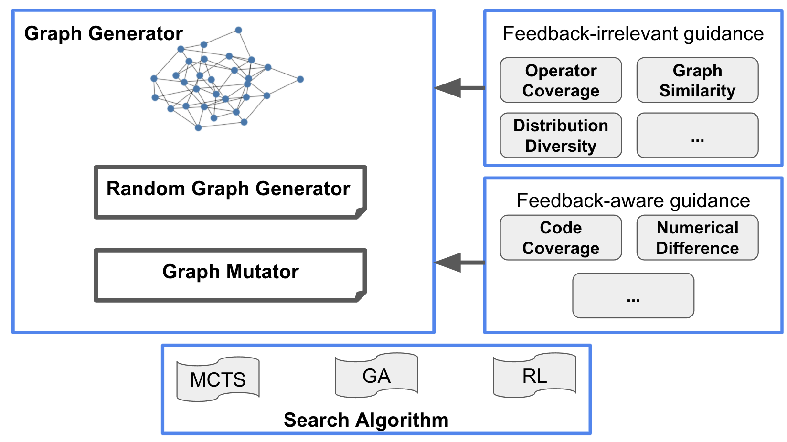

# TVMGraphFuzzer

## Overall structure

## Graph Generator

### `random_graph`

random_graph::get_sub_graph --> Generate random sub graph. 

- Each sub graph is generated from random graph generator

- By stacking the random generated sub graphs, we can get a more complex graph.

Under the file, there is also the data structure for converting the networkx graph into computation graph.

### `op_constraint`

Under this file, there is the constraint definition for every operator.

### `op_projection`

Under this file, there is the rule for operator --> graph node mapping.

## Sequence Generator

